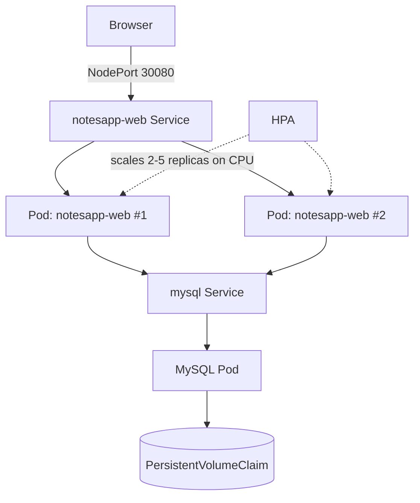

# Project 2: Kubernetes Cluster Deployment (k3s)

## Overview
A multi-tier application (Flask + MySQL) deployed on a real Kubernetes cluster with production-grade patterns: rolling updates, health checks, persistent storage, secrets management, and horizontal autoscaling.

## Architecture



## Tech Stack
- **Orchestration**: Kubernetes (k3s — a lightweight, CNCF-certified distribution)
- **Application**: Same Flask + MySQL image built and pushed by the Project 1 CI/CD pipeline (`faizan1112002/notesapp-web`)
- **Storage**: PersistentVolumeClaim for MySQL data durability across pod restarts
- **Config/Secrets**: Kubernetes Secrets for database credentials (not hardcoded)

## What Was Deployed
| Resource | Purpose |
|---|---|
| Namespace | Isolates all project resources (`notesapp`) |
| Secret | Stores MySQL credentials securely |
| PersistentVolumeClaim | Durable storage for MySQL data |
| Deployment (mysql) | Single-replica database |
| Deployment (notesapp-web) | 2 replicas, RollingUpdate strategy (zero-downtime deploys) |
| Service (mysql) | ClusterIP — internal-only access for the app |
| Service (notesapp-web) | NodePort — exposes the app externally on port 30080 |
| HorizontalPodAutoscaler | Scales the app from 2 to 5 replicas based on CPU load |

## Key Engineering Decisions & Problems Solved
- **Chose k3s over full Kubernetes**: A single lightweight binary that runs real Kubernetes APIs, well-suited for resource-constrained environments while remaining production-representative.
- **Zero-downtime deployments**: `maxUnavailable: 0` in the rolling update strategy ensures at least one pod is always serving traffic during an update.
- **Health probes**: readiness and liveness probes prevent traffic from reaching a pod before its database connection is established (the app has built-in retry logic for this), and automatically restart pods that stop responding.
- **Debugged a real scheduling failure**: pods were stuck `Pending` due to a `disk-pressure` taint automatically applied by the kubelet when node disk usage crossed its eviction threshold. Diagnosed via `kubectl describe node` and `kubectl describe pod`, resolved by reclaiming disk space and restarting the kubelet.
- **Self-healing verified**: manually deleted a running pod to confirm the Deployment controller immediately replaces it to maintain the desired replica count.

## Project Structure
```
project-2-kubernetes/
├── 00-namespace.yaml
├── 01-mysql-secret.yaml
├── 02-mysql.yaml          # PVC + Deployment + Service
├── 03-app.yaml            # Deployment (2 replicas) + NodePort Service
└── 04-hpa.yaml            # HorizontalPodAutoscaler
```

## How to Run It Yourself
```bash
kubectl apply -f 00-namespace.yaml
kubectl apply -f 01-mysql-secret.yaml
kubectl apply -f 02-mysql.yaml
kubectl apply -f 03-app.yaml
kubectl apply -f 04-hpa.yaml

kubectl get pods -n notesapp
```

## Result
A self-healing, horizontally scalable application running on real Kubernetes infrastructure — the same image built by the CI/CD pipeline in Project 1, now orchestrated instead of run as a single container.
